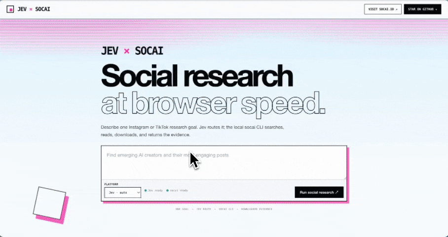

# Jev × socai

**Jev decides the route. [socai](https://socai.io/) does the real browser work. You get searchable posts, downloaded videos, a complete table, and an evidence-led agent report in one local page.**

[Visit socai.io](https://socai.io/) · [Star socai on GitHub](https://github.com/socai-io/socai) · [Meet Jev at TypeSafe](https://typesafe.ai/)

## See it run



Give the demo a social research goal such as “find the fastest-growing AI wearable conversations on TikTok.” Jev makes one typed choice—Instagram, TikTok, or unsupported—then the local socai CLI searches the live site. TikTok results continue into `get-videos --download-media`, so the result page can play the files socai actually captured instead of showing a fabricated preview. The new non-interactive `socai research` command then runs the real socai agent loop, streams captured evidence into the page, and writes the final Markdown report.

## From half an hour to one minute

A manual social scan is a chain of small tasks: choose a network, search, open posts, copy captions and engagement, download videos, normalize rows, and assemble evidence. Jev × socai turns that chain into one request.

| Workflow | Manual research baseline | Jev × socai demo target | Reduction |
| --- | ---: | ---: | ---: |
| Search one social topic | 5–10 min | 10–20 s | up to 30× faster |
| Open and inspect 10 posts | 10–15 min | 20–30 s | up to 45× faster |
| Download video evidence | 5–10 min | included in the run | no separate step |
| Build a normalized results table | 5–15 min | immediate | no copy/paste |
| **End-to-end trend scan** | **about 30 min** | **about 50 s** | **about 36× faster** |

The 30-minute baseline and 50-second target are an illustrative demo comparison, not a universal benchmark. Live duration depends on result count, video size, login state, network conditions, and platform throttling. The UI always shows the measured elapsed time for the current run.

## What the demo returns

The result page is designed for a screen recording and stays on one page:

- live elapsed time while Jev and socai work;
- streamed evidence cards instead of a frozen loading screen or raw CLI log;
- a top-to-bottom TypeSafe-inspired gradient scan during capture;
- every returned post or video as a rich evidence card;
- local playback for videos downloaded by socai;
- captions, authors, dates, engagement, duration, comments, and source links;
- a complete, normalized evidence table;
- a socai agent report with an executive summary, evidence, themes, audience signals, limits, and sources.

Example table shape:

| Platform | Author | Title / caption | Published | Views | Likes | Comments | Shares | Duration | Media |
| --- | --- | --- | --- | ---: | ---: | ---: | ---: | ---: | --- |
| TikTok | creator handle | Captured post caption | ISO timestamp | 128K | 9.4K | 312 | 840 | 34s | Downloaded |
| Instagram | creator handle | Captured reel or post | ISO timestamp | — | 4.1K | 96 | — | — | Preview |

The saved run still retains the structured CLI result for reproducibility, while the recording UI stays focused on posts, video, timing, the comparison table, and the final report.

## One goal, one typed route, real CLI execution

```text
research goal
    │
    ▼
Jev typed decision ── instagram_search ──┐
                   ├─ tiktok_search ─────┼─► socai browser workflow
                   └─ unsupported ───────┘            │
                                                       ├─ search results
                                                       ├─ post details
                                                       ├─ comments
                                                       ├─ downloaded video
                                                       └─ research agent
                                                                  │
                                                                  ▼
                                                      cards + table + report
```

Jev receives the complete natural-language request. socai receives the normalized literal search term expected by its adapter. The model cannot supply shell fragments, selectors, or browser actions; the Node process launches socai with an argument array.

For TikTok, a successful run uses both stable CLI stages:

```bash
socai tiktok search "AI wearables" --num 10 --pretty
socai tiktok get-videos --video <url> --download-media --pretty
```

Instagram search uses the native dev adapter:

```bash
socai instagram search "AI wearables" --num 10 --pretty
```

Both routes finish through the same non-interactive agent entrypoint:

```bash
socai research "Compare the strongest signals and cite the captured posts" \
  --platform instagram --max-steps 6 --pretty
```

## Run the recording demo

Requirements: Node.js 20+, an OpenRouter key with Jev access, and the included socai dev build.

```bash
npm install
cp .env.example .env
# Add OPENROUTER_API_KEY to .env.
npm start
```

The browser opens directly at `http://127.0.0.1:8766`. The server binds only to the loopback interface, so no local API token or token-bearing URL is required. For the cleanest recording:

1. Enter a goal and leave the platform on **Jev · auto**.
2. Start the run and keep the live timer and streamed evidence cards in frame.
3. Wait for the captured-post grid.
4. Play a downloaded video directly in its card.
5. Scroll through the complete table and the **socai research report**.

The header includes direct links to [socai.io](https://socai.io/) and the [socai GitHub repository](https://github.com/socai-io/socai).

## Configuration

The app loads the first available environment source:

1. `JEV_SOCIAL_ENV_FILE`, when explicitly set;
2. this repository's `.env`;
3. `docs/work/20260918-2/.env` in the parent socai workspace.

Both `OPENROUTER_API_KEY=...` and the existing lowercase `openrouter=...` form are accepted. `SOCAI_BIN` can point to a custom build. In this workspace the default resolver discovers:

```text
docs/work/20260918/worktrees/dev-platform-validation/target/debug/socai
```

That build is based on socai dev / v0.5.6 and exposes Instagram search, TikTok search, detail reading, comments, media download, and the non-interactive research agent used by this demo.

Browser selection follows socai instead of being overridden by the demo. With no override, socai uses the existing Chrome debugging session and can reuse an authenticated profile such as the validated Deeptensor Profile 5. Set `SOCAI_CHROME_PROFILE=managed` only for an isolated browser, or set `SOCAI_CDP_WS` / `SOCAI_CDP_URL` for an explicit remote browser endpoint.

## CLI usage

```bash
npm start -- status
npm start -- search "find AI wearable trends on TikTok" --platform auto --limit 10
npm start -- search "find emerging design creators on Instagram" --platform auto --limit 10
npm start -- serve --port 8766 --no-open
```

The `--limit` option remains available to the command-line interface. The web demo intentionally captures and displays up to four previewable records, prioritizing downloaded video, playable video URLs, posters, and thumbnails so the recording stays fast and avoids empty cards.

## Why this is genuinely socai

- **The server launches the configured socai executable.** It does not contain a second browser scraper.
- **Progress is streamed from the child process.** Browser and download activity appears while the run is still active.
- **Video playback uses a file written by socai.** Local media paths are validated under the socai run directory and exposed through short-lived loopback-only URLs with HTTP range support.
- **The final report comes from the socai agent.** The UI renders the Markdown report emitted by `socai research`; it does not generate a browser-side summary.
- **Failures stay visible.** Login gates, challenges, rate limits, invalid JSON, missing adapters, download failures, and timeouts are reported instead of replaced with fixtures.
- **Credentials remain separated.** The OpenRouter key stays in the Node process and is removed from the socai child environment.

## Small enough to audit

| File | Responsibility |
| --- | --- |
| [`src/classifier.js`](src/classifier.js) | Jev route schema and OpenRouter Decisions request |
| [`src/query.js`](src/query.js) | Natural-language goal to literal search query |
| [`src/socai.js`](src/socai.js) | socai capability checks, search, video hydration, downloads, research, and stdout parsing |
| [`src/app.js`](src/app.js) | Evidence capture, agent research, and result merging |
| [`src/server.js`](src/server.js) | NDJSON streaming, loopback security, and range-based local media serving |
| [`public/app.js`](public/app.js) | Live timer, progress stream, video cards, details, table, and final output |

## Evidence and limits

The local Instagram smoke test on September 19, 2026 used `typesafe/jev-1.13-20260917`; Jev selected Instagram and the real socai CLI returned live results successfully. Timing from one smoke test is evidence of execution, not a latency guarantee.

Remote sites still control availability. Login state, challenges, regional behavior, rate limits, changing layouts, and expiring media URLs can affect a run. The application is read-only: it does not post, like, follow, message, or silently substitute sample data.

## Development

```bash
npm test
npm run check
```

Tests use local mock binaries and do not require live model calls. Real searches call OpenRouter and launch the configured socai browser workflow. Run records remain under `~/.jev-social/runs/`; credentials and `.env` files remain ignored.

---

Built with [Jev by TypeSafe](https://typesafe.ai/) and [socai](https://socai.io/). If this workflow is useful, [star socai on GitHub](https://github.com/socai-io/socai).
